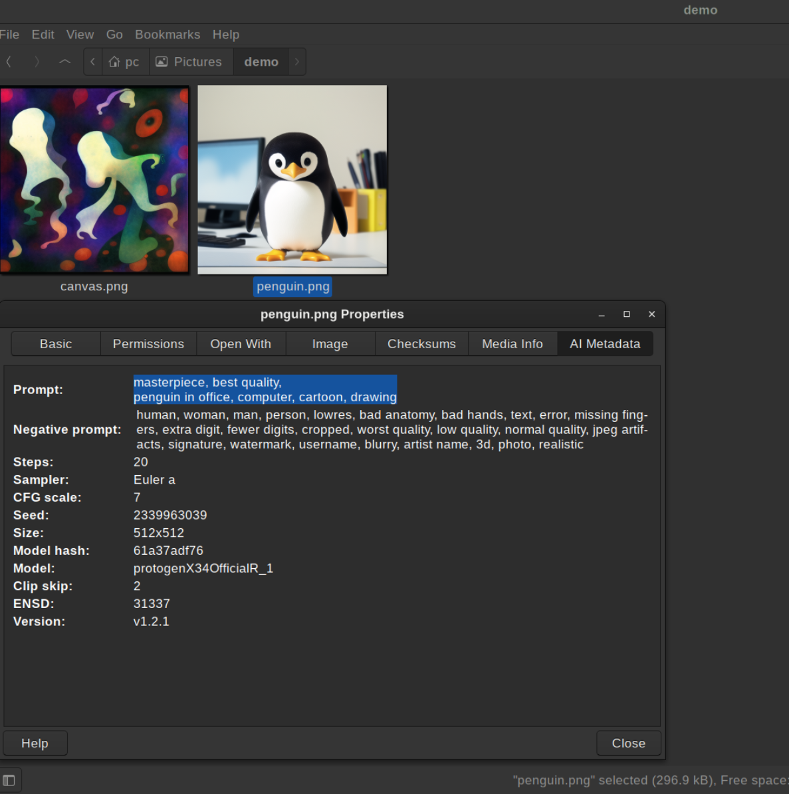

# nemo-ai-image-tab
View AI image information from the properties tab

**installation**  
Place nemo-aimeta.py in ~/.local/share/nemo-python/extensions.  
Enable plugin in Nemo Preferences window.
Requires piexif, PIL, and nemo-python

